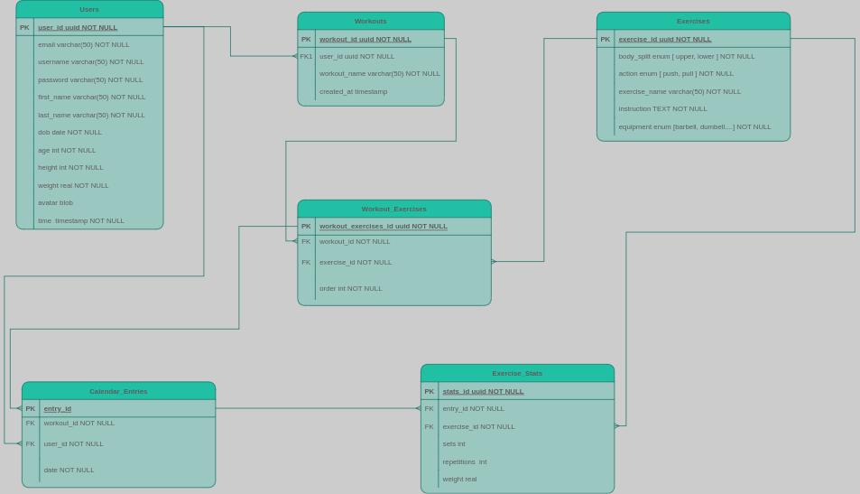

# **WORKOUT TRACKER** 

## **Description** 
_This API is being developed as part of a fullstack collab project and is a work in progress. The current scope of the api is to expose endpoints which allow user Registration and Authentication, after which the user is Authorized to Read exercises and Create workouts. The user can now Update profile information, Add exercises to a workout and Read all exercises within a particular workout_  

## **Project Goal**
To offer an accessible application that enables a user to easily plan workouts and Track personal progress.  

### **Tech Used**

  
  ### Frameworks
   * 
   * ## TypeORM

### **Current ERD**

    

## Created by

- [John Houlihan](https://github.com/jphoulihan "Visit John's GitHub")  

## License

