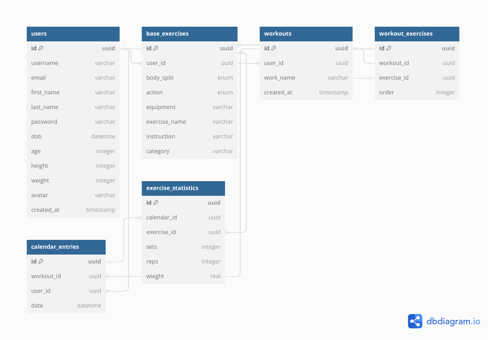

# **WORKOUT TRACKER** 

## **Description** 
_This API is being developed as part of a fullstack collab project and is a work in progress. The current scope of the api is to expose endpoints which allow user Registration and Authentication, after which the user is Authorized to Read exercises and Create workouts. The user can now Update profile information, Add exercises to a workout and Read all exercises within a particular workout_<br/><br/>

## **Project Goal**
To offer an accessible application that enables a user to easily Plan workouts and Track personal progress.<br/><br/>

### **Tech Used**

  
  ### Frameworks
   * 
   * ## TypeORM

### **Current ERD**

- using single table inheritence, base_exercises contains stock exercises provided by the developers and custom exercises created by the user. Users can create workout routines with a mixture of both custom and stock exercises. 

<br/><br><br/><br/>

### Endpoint Examples

### GET: _http://localhost:8000/workouts/id/f13d422d-a7b4-4228-aa12-1b1b2e8b988d_

```
[
    {
        "id": "f13d422d-a7b4-4228-aa12-1b1b2e8b988d",
        "workoutName": "Big Pull Day",
        "createdAt": "\"2023-06-30T12:14:41.203Z\"",
        "workoutExercises": [
            {
                "id": "d8733fa0-0790-48e2-aabf-2c7d87fb8eb9",
                "order": 1,
                "exercise": {
                    "id": "52f74f62-dc38-48d1-9ee6-f661b36ca43a",
                    "bodySplit": "upper",
                    "action": "pull",
                    "equipment": "dumbbell",
                    "exerciseName": "Hammer Curl",
                    "instruction": "Dumbell in each hand. Knees slightly bent. Glutes engaged. Neutral grip. Bring one dumbbell to shoulder by hinging the elbow, squeeze bicep. Alternate reps"
                }
            },
            {
                "id": "f0ef2820-85c9-4b08-a0f3-b481bdaa7bcd",
                "order": 2,
                "exercise": {
                    "id": "902e2e65-b5c9-49d7-beae-ae8c9e64258d",
                    "bodySplit": "upper",
                    "action": "pull",
                    "equipment": "barbell",
                    "exerciseName": "Bicep Curl",
                    "instruction": "Knees slightly bent. Glutes engaged. Arms straight down. Grip sligtly wider than hips. Squeeze barbell with index and little finger. Hinge elbow and bring barbell to chin. Focus on engaging the bicep."
                }
            },
            {
                "id": "98899710-bead-4a8e-a91c-ba6ed3915c17",
                "order": 3,
                "exercise": {
                    "id": "a733157f-5c1f-4a1e-9877-c2a22e91c225",
                    "bodySplit": "upper",
                    "action": "pull",
                    "equipment": "dumbbell",
                    "exerciseName": "Row",
                    "instruction": "With dumbbell in hand, place free hand on bench. Take a sprinters stance. Leave dumbbell arm hang straight down, until lat is stretched. Drive elbow back, maintaining a closed distance to the hip"
                }
            },
            {
                "id": "4e4242fc-6108-4f2b-b214-4e95310d6681",
                "order": 4,
                "exercise": {
                    "id": "5637dca3-b5b5-4c3f-bf9c-98f8b1656a31",
                    "bodySplit": "upper",
                    "action": "pull",
                    "equipment": "dumbbell",
                    "exerciseName": "Lateral Raise",
                    "instruction": "Dumbell in each hand. Knees slightly bent. Glutes engaged. Neutral grip. Hips hinged, torso forward at 30 degree angle. Raise dumbells laterally up and away with elbows slightly bent."
                }
            }
        ]
    }
]
```

### PATCH: _http://localhost:8000/users/profile_

```
Request

{
    "firstName": "John",
    "lastName": "Meadows",
    "age": 49,
    "weight":102.1,
    "height": 167.5,
    "avatar": "https://cdn.muscleandstrength.com/sites/default/files/field/image/author/john-meadows.jpg",
    "username": "Mountain Dawg"
}

Response

{
  {
    "id": "98d67f2e-8b69-4c46-928a-b000b47c9ca7",
    "firstName": "John",
    "lastName": "Meadows",
    "age": 49,
    "weight": 102.1,
    "height": 167.5,
    "avatar": "https://cdn.muscleandstrength.com/sites/default/files/field/image/author/john-meadows.jpg",
    "username": "Mountain Dawg",
    "email": "jmeadows@email.com",
    "createdAt": "\"2023-06-30T11:43:55.319Z\""
}
}
```

## Created by

- [John Houlihan](https://github.com/jphoulihan "Visit John's GitHub")<br/><br/>

## License

[](https://opensource.org/licenses/MIT)


